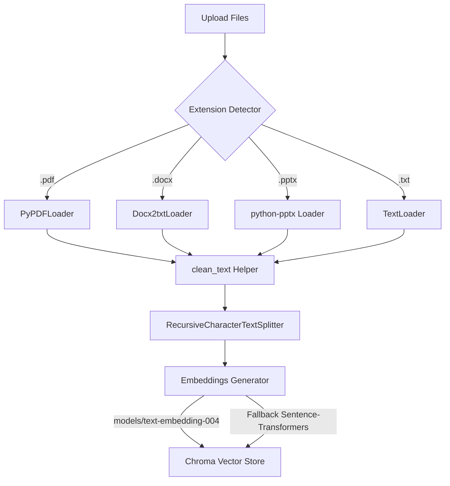

# Production-Grade Agentic Multi-Document RAG Knowledge Assistant

A professional, resume-ready Retrieval-Augmented Generation (RAG) system built with **LangChain**, **LangGraph**, **Gemini 2.5 Flash**, **ChromaDB**, and **Streamlit**. 

This system supports ingested text from PDF, DOCX, PPTX, and TXT files, leverages LangGraph self-correcting agent loops, performs query expansion, uses LLM-in-the-loop evaluations, and tracks performance analytics.

---

## 🏗️ System Architecture

### 1. Ingestion Pipeline


### 2. LangGraph Agentic Workflow
```mermaid
graph TD
    UserQuery((User Query)) --> QA[Query Understanding Agent]
    QA --> |Query Expansion & Complexity Analysis| RA[Retrieval Agent]
    RA --> |Chroma Querying & Score Merging| CA[Context Optimization Agent]
    CA --> |De-duplication & Narrative Sorting| RG[Response Generation Agent]
    RG --> |Gemini 2.5 Flash Response| VA[Validation Agent]
    VA --> |Check Groundedness & Citations| Cond{Hallucination Detected?}
    Cond -- Yes & Retries < 2 --> |Feedback & Self-Correction| RG
    Cond -- No or Retries >= 2 --> FinalAnswer[Final Answer & In-line Evaluator]
```

---

## ⚡ Key Features

* **Multi-Document Upload**: Handles PDF, DOCX, PPTX, and TXT formats simultaneously (up to 10 files).
* **Self-Correcting Agent Loop**: Uses **LangGraph** to route responses back to Gemini for self-correction if the validation agent flags hallucinated or ungrounded claims.
* **Query Expansion**: Generates 3 query variations to retrieve diverse, semantic search matches.
* **Normalized Confidence Scores**: Converts raw L2 distances into a percentage similarity score (`1 / (1 + distance)`) to rate search confidence.
* **Groundedness Verification**: Filters claims against the retrieved chunks to eliminate hallucinations.
* **Interactive Evaluation**: Evaluates every turn on Context Precision, Context Recall, Faithfulness, and Answer Relevance.
* **Plotly Performance Analytics**: Displays latency analysis (retrieval vs. generation time) and quality trend charts.
* **Transcripts Export**: Exports full chat transcripts to text or high-quality PDF reports.
* **Metadata Filters**: Targets search to specific file names or file types.

---

## 🛠️ Installation & Setup

### Prerequisites
* Python 3.11 or higher
* Google Gemini API Key

### 1. Clone & Initialize Environment
```bash
# Create virtual environment
python -m venv .venv

# Activate environment (Windows PowerShell)
.venv\Scripts\Activate.ps1

# Activate environment (Linux/macOS)
source .venv/bin/activate
```

### 2. Install Dependencies & Validate
All dependencies are strictly pinned in `requirements.txt` to resolve the protobuf version mismatch error (`TypeError: Descriptors cannot be created directly`) by aligning transitive Google API and GRPC packages natively.

```bash
# Install pinned dependencies
pip install -r requirements.txt

# Run dependency diagnostics to check for any version conflicts
python diagnose_dependencies.py
```

### 3. Setup Environment Variables
Create a `.env` file in the root directory:
```env
GEMINI_API_KEY=your_gemini_api_key_here
```

---

## 🚀 Running the Application

To run the Streamlit application locally, run the following command:
```bash
streamlit run app.py
```
This will open the application in your default web browser (typically at `http://localhost:8501`).

---

## 🧪 Running Unit Tests

The test suite validates loaders, text helpers, path configurations, and LangGraph agent node states.
Run the tests with:
```bash
python -m unittest discover -s tests
```

---

## 📂 Project Structure

```
├── app.py                      # Streamlit application entry point
├── requirements.txt            # System dependencies
├── README.md                   # System documentation
├── config/
│   └── settings.py             # Global constants & path configs
├── loaders/
│   ├── pdf_loader.py           # PyPDF parser
│   ├── docx_loader.py          # Word document parser
│   ├── pptx_loader.py          # PowerPoint parser
│   └── txt_loader.py           # Text parser
├── rag/
│   ├── ingest.py               # Document splitter & Chroma DB management
│   ├── retriever.py            # Similarity search & metadata filter
│   ├── embeddings.py           # Google/Sentence-Transformers switcher
│   ├── memory.py               # Prompt chat history formatter
│   └── evaluator.py            # Context & faithfulness scorer
├── agents/
│   ├── query_agent.py          # Intent parsing & query expansion
│   ├── retrieval_agent.py      # Multi-query vector db lookup
│   ├── context_agent.py        # Redundant filtering & sorting
│   ├── response_agent.py       # Context-grounded response generation
│   ├── validation_agent.py     # Hallucination detector & routing
│   └── workflow.py             # LangGraph state & conditional edge compiler
├── utils/
│   ├── logger.py               # Console & File logger
│   ├── metrics.py              # Performance logs (metrics.json)
│   └── helpers.py              # Text clean & citation compiler
└── tests/
    └── test_rag.py             # Loader & Node unittest suite
```
